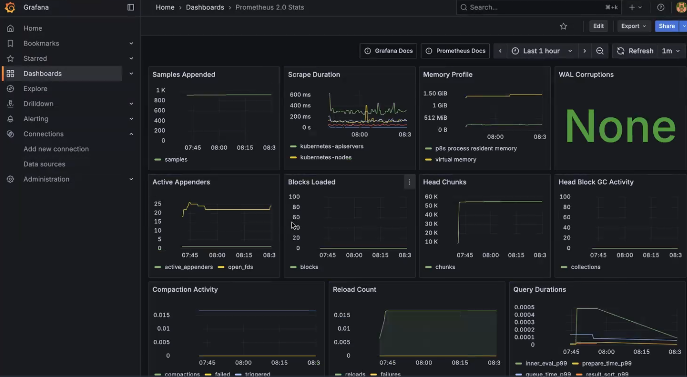

# Grafana Monitoring & Alerting Setup 📊

## Overview
This project demonstrates that how i setup the  **Grafana dashboards** and **alerting rules** for system monitoring.  
It showcases that how observability can be implemented to visualize key metrics and trigger alerts on defined thresholds.

## Features
- 📈 Grafana Dashboard for real-time metrics
- 🚨 Alerting configured for threshold breaches
- 🔗 Integration with Prometheus as a data source (or any available source)

## Screenshots
### Dashboard

### Alerting

## Technologies
- Grafana  
- Prometheus (as data source, optional)  
- Linux/Server environment
